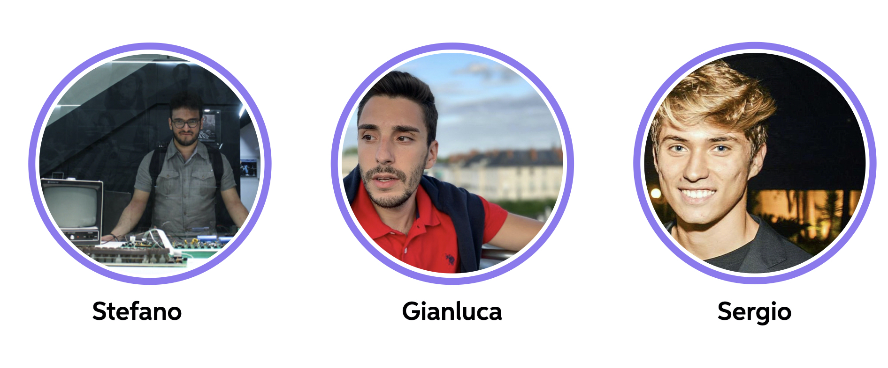

#  The team

We are three students attending the Master of Science of Engineering in Computer Science in Sapienza University of Rome and we are at our last year. We really appreciate working together and we had fun since we enjoy programming and make something that is ours, that has our blueprint. This project takes a while to be fully developed, since we tried to not leave anything to chance, but hopefully include any aspect in the big picture.

##  "All for one, one for all"

Working together may be not simple, sometimes can be complex organize tasks and job, but here we based our work on collaboration and continuous support. Everyone was present to help the others with some issue or just for discuss about some idea or brand new feature to add to our application. **It was a journey, but we enjoyed the trip**. A very good experience. Anyway, let's go in more details about the **contribution of each team member**.

###  Customizing your jekyll website

This is the base Jekyll theme. You can find out more info about customizing your Jekyll theme, as well as basic Jekyll usage documentation at [jekyllrb.com](https://jekyllrb.com/)

You can find the source code for Minima at GitHub:
[jekyll][jekyll-organization] /
[minima](https://github.com/jekyll/minima)

You can find the source code for Jekyll at GitHub:
[jekyll][jekyll-organization] /
[jekyll](https://github.com/jekyll/jekyll)

[jekyll-organization]: https://github.com/jekyll
