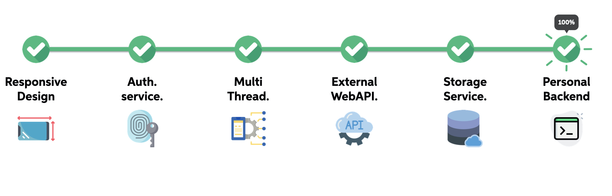
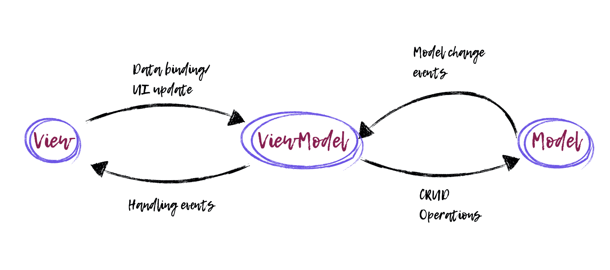

# Building blocks



Here we can find an overview of the building blocks of our application, some of them were also the mandatory requirements of our project. We have a responsive layout, since we used the ```ConstraintLayout```of Android supporting also landscape mode for every view, Google and Facebook sign in/sign up in our [login](https://sergiopicca.github.io/smartPi-app/pages/ui-auth.html), a multi-thread application, since many of our operations cannot be performed on the UI thread because we would like to prevent a bad UX and finally we deployed a personal backend on our [RaspberryPi](https://sergiopicca.github.io/smartPi-app/pages/backend-raspberry.html), supported by an external storage service by [Firebase](https://sergiopicca.github.io/smartPi-app/pages/backend-firebase.html).

##  Design of the application

In this section will be describe the software design pattern of SmartPi application. We used Android Studio for developing the front-end and we write the app in **Kotlin**, in order to try something different from Java. The design of the application is based on the **Model View ViewModel** (MVVM), since we tried to follow the suggestions of the Android documentation.

##  Concept of activity

Every Android App is made up of activities that initiates code invoking specific callbacks methods. The activity typically provides the screen where the user interaction takes place and it can occupy the whole screen or not, so one application can contain more activities or fragments. Furthermore an activity can host one or more fragments (a sort of "sub-activity") to support more dynamic and flexible UI, more info can be find in the official [developer android documentation](https://developer.android.com/guide/components/fragments).

## Model View ViewModel

Apart from the official documentation there is an interesting article on Medium that explain in a clever and fast way the MVVM design architecture, that you can find [here](https://medium.com/upday-devs/android-architecture-patterns-part-3-model-view-viewmodel-e7eeee76b73b). Basically, the most important principle to follow is the **separation of concern**, trying to avoid to write all the code inside the activity or the fragment.



We tried to stick to this principle as much as possible, but since this was our first experience with this paradigm, we achieved a pretty good result but is not perfect, since in some occasion we give to much *importance* to the view model, we allow it to call some Web API and this may not result in a very desirable user experience. In practice, the view model should not be aware of the how data are fetched, namely how the model is provided, it should only react to UI interaction and perform the action triggered by the user. Moreover, talking about the view model we really find very useful the presence of **LiveData** and **MutableLiveData**. Live data are observable data holder, that allow to monitor the changes of data without creating explicit and rigid dependency paths between them.
