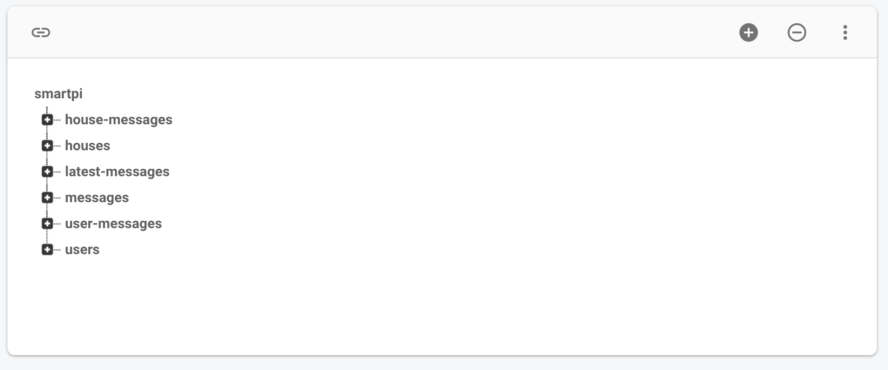

# Realtime database


We decided to use Firebase in order to store the relevant data of our application. In particular, we decided to use the Realtime database that is a **NoSQL** database, where the data is stored as JSON, very easy to maintain and to update. In general, we found the Firebase service very flexible, supporting any kind of service we needed and one nice think was the use of the **functions** to perform some action when data changes, such as sending notification to our clients, but let's examine the structure of the data first.

##  Organization of the data

In the application we have many different data to handle, the information of the user, the information about the user's house, the number of rooms, the devices in the room and also the messages of between the members of the family. In the following image we can a look on how the data are organized.



Here we can find the main nodes of the JSON file of the Realtime database, let's consider the "houses" one, where we have stored the data about the houses of our users, we have indication of address, the location (lat and long) and the rooms. **Rooms have a really important role in our app**, because is where devices are located.

##  Read data

In order to fetch data from the database, there is an easy way to do it by using Firebase callbacks. We have to specify the path that we want to get and **listen** for some events, in fact Realtime firebase has some different kind of event listener, depending if we want to listen our database once (```SingleValueEventListener```), continuously  (```ValueEventListener```) or if we deal with a list of items (```ChildEventListener```). Each kind of event requires to override some methods, typically they are just two:
1. ```onDataChange```  method to read a static snapshot of the contents at a given path, as they existed at the time of the event. This method is triggered once when the listener is attached and again every time the data, including children, changes.
2. ```onCancelled``` method that is called if the read is canceled. For example, a read can be canceled if the client doesn't have permission to read from a Firebase database location.

Only in the case ```ChildEventListener``` we have different methods to implement, since they refer to each child of the selected path. Another interesting functionality that is important to mention is the support for **offline capabilities**, by using ```setPersistenEnabled``` and set it to ```true```.
