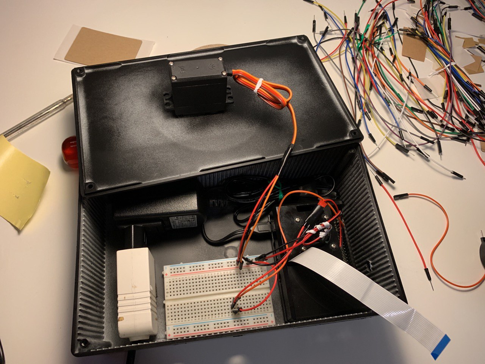

# Raspberry Pi backend

The backend on the Raspberry Pi offers the APIs to manage and control the piCamera module and the servo motor attached on the device.

The backend must be personal and you need to own your Raspberry Pi, camera and motor.

### REST server

The server is developed in python. The choice of this programming language is given by the fact that python offers really good library to handle both the piCamera module and the GPIO pin in PWM mode (needed to handle the servo motor).

To develop the REST APIs it has been used the [Flask library](https://flask.palletsprojects.com/en/1.1.x/). But this library does not offer a server that can be used in production enviroment, to overcome this issue it is used [Waitress](https://docs.pylonsproject.org/projects/waitress/en/stable/), that on the contrary permits to use a Flask server in a production enviroment.

### Handling the camera

It has been used the [piCamera](https://picamera.readthedocs.io/en/latest/) library to develop all the features relative to the camera (stream, motion detection, face recognition).

A **big thanks** to Adrian and his beatiful tutorials! Check his [website](https://www.pyimagesearch.com) it is really worth it!

In particular:

* [Install OpenCV on Raspberry Pi](https://www.pyimagesearch.com/2018/09/26/install-opencv-4-on-your-raspberry-pi/)
* [Stream and simple motion detection](https://www.pyimagesearch.com/2019/09/02/opencv-stream-video-to-web-browser-html-page/)
* [Motion detection (complete)](https://www.pyimagesearch.com/2015/06/01/home-surveillance-and-motion-detection-with-the-raspberry-pi-python-and-opencv/)
* [Face recognition](https://www.pyimagesearch.com/2018/06/25/raspberry-pi-face-recognition/)

## APIs

### No authorization needed

#### **Register the house_id on the Raspberry Pi, and get your token**
This API is used to enable the upload of the images on firebase storage passing the house_id.
It returns the token. (The provided token has a validity of 24 hours)

| REQUEST PARAMETERS | VALUE |
|---|---|
|       HTTP METHOD:      | POST                              |
| HTTP HEADER (optional): | `"ContentType : application/json"`  |
| POST PARAMETERS | `{"house_id" : <house_id> , "password" : <password> }`
| REQUEST URL: | your-api-url/signup |

| RESPONSE STATUS | CODE | VALUE | DESCRIPTION |
| --- | --- | --- | --- |
| ERROR | 401 | `{"status" : "error" , "message" : "Please, provide house name, house id and password to login."}` | Credential not provided |
| ERROR | 401 | `{"status":"error", "message":"Invalid credential"}` | Invalid credential |
| SUCCESS | 200 | `{"status":"success" , "auth-token" : <auth-token> }`| The authorization token is returned. Validity of 24 hours |

#### **Get your token**
(The provided token has a validity of 24 hours)

| REQUEST PARAMETERS | VALUE |
|---|---|
|       HTTP METHOD:      | POST                              |
| HTTP HEADER (optional): | `"ContentType : application/json"`  |
| POST PARAMETERS | `{"password" : <password> }`
| REQUEST URL: | your-api-url/login |

| RESPONSE STATUS | CODE | VALUE | DESCRIPTION |
| --- | --- | --- | --- |
| ERROR | 401 | `{"status" : "error" , "message" : "Please, provide password to login."}` | Credential not provided |
| ERROR | 401 | `{"status":"error", "message":"Invalid credential"}` | Invalid credential |
| SUCCESS | 200 | `{"status":"success" , "auth-token" : <auth-token> }`| The authorization token is returned. Validity of 24 hours |

### Authorization needed

#### **Display an "Hello, World!" message**
Used to check the availability of the device, and to check if actual token is expired.

| REQUEST PARAMETERS | VALUE |
|---|---|
|       HTTP METHOD:      | GET                              |
| HTTP HEADER: | `"Authorization : <token>" ` |
| HTTP HEADER (optional): | `"ContentType : application/json"` |
| REQUEST URL: | your-api-url/ |

| RESPONSE STATUS | CODE | VALUE | DESCRIPTION |
| --- | --- | --- | --- |
| SUCCESS | 200 | `{"status":"success","message":"Hello, World!"}`| Display an "Hello, World!" message |

#### **Get the motion detection status**

| REQUEST PARAMETERS | VALUE |
|---|---|
|       HTTP METHOD:      | GET                              |
| HTTP HEADER: | `"Authorization : <token>" ` |
| HTTP HEADER (optional): | `"ContentType : application/json"`  |
| REQUEST URL: | your-api-url/motion |

| RESPONSE STATUS | CODE | VALUE | DESCRIPTION |
| --- | --- | --- | --- |
| ERROR | 401 | `{"status":"error" , "message":"token missing"}` | Authorization token not provided in HTTP HEADER |
| ERROR | 401 | `{"status":"error" , "message":"token expired"}` | Authorization token provided expired |
| ERROR | 401 | `{"status":"error" , "message":"token invalid"}` | Authorization token provided invalid |
| SUCCESS | 200 | `{ "status": "success","message":"Motion active"}` | Returned if motion detection is active |
| SUCCESS | 200 |`{ "status": "success","message":"Motion not active"}` | Returned if motion detection is disable |

#### **Set motion detection status**

| REQUEST PARAMETERS | VALUE |
|---|---|
|       HTTP METHOD:      | GET                              |
| HTTP HEADER: | `"Authorization : <token>" ` |
| HTTP HEADER (optional): | `"ContentType : application/json"`  |
| GET PARAMETERS | ` motion=<0/1>` |
| HTTP HEADER (optional): | `"ContentType : application/json"`  |
| REQUEST URL: | your-api-url/motion?motion=`<value>` |

| RESPONSE STATUS | CODE | VALUE | DESCRIPTION |
| --- | --- | --- | --- |
| ERROR | 401 | `{"status":"error" , "message":"token missing"}` | Authorization token not provided in HTTP HEADER |
| ERROR | 401 | `{"status":"error" , "message":"token expired"}` | Authorization token provided expired |
| ERROR | 401 | `{"status":"error" , "message":"token invalid"}` | Authorization token provided invalid |
| ERROR | 200 | `{ "status": "error","message":"Motion field invalid. Please specify 1 (to active the motion) or 0 (to disable it)"} ` | Value of parameter invalid |
| SUCCESS | 200 | `{ "status": "success","message":"Motion activated"}` | Returned if motion detection is actived |
| SUCCESS | 200 |`{ "status": "success","message":"Motion disabled"}` | Returned if motion detection is disabled |

#### **Get the face detection status**

| REQUEST PARAMETERS | VALUE |
|---|---|
|       HTTP METHOD:      | GET                              |
| HTTP HEADER: | `"Authorization : <token>" ` |
| HTTP HEADER (optional): | `"ContentType : application/json"`  |
| REQUEST URL: | your-api-url/face |

| RESPONSE STATUS | CODE | VALUE | DESCRIPTION |
| --- | --- | --- | --- |
| ERROR | 401 | `{"status":"error" , "message":"token missing"}` | Authorization token not provided in HTTP HEADER |
| ERROR | 401 | `{"status":"error" , "message":"token expired"}` | Authorization token provided expired |
| ERROR | 401 | `{"status":"error" , "message":"token invalid"}` | Authorization token provided invalid |
| SUCCESS | 200 | `{ "status": "success","message":"Face detection active"}` | Returned if face detection is active |
| SUCCESS | 200 |`{ "status": "success","message":"Face detection not active"}` | Returned if face detection is disable |

#### **Set motion detection status**

| REQUEST PARAMETERS | VALUE |
|---|---|
|       HTTP METHOD:      | GET                              |
| HTTP HEADER: | `"Authorization : <token>" ` |
| HTTP HEADER (optional): | `"ContentType : application/json"`  |
| GET PARAMETERS | ` detection=<0/1>` |
| HTTP HEADER (optional): | `"ContentType : application/json"`  |
| REQUEST URL: | your-api-url/face?detection=`<value>` |

| RESPONSE STATUS | CODE | VALUE | DESCRIPTION |
| --- | --- | --- | --- |
| ERROR | 401 | `{"status":"error" , "message":"token missing"}` | Authorization token not provided in HTTP HEADER |
| ERROR | 401 | `{"status":"error" , "message":"token expired"}` | Authorization token provided expired |
| ERROR | 401 | `{"status":"error" , "message":"token invalid"}` | Authorization token provided invalid |
| ERROR | 200 | `{ "status": "error","message":"Detection field invalid. Please specify 1 (to active the face detection) or 0 (to disable it)"}` | Value of parameter invalid |
| SUCCESS | 200 | `{ "status": "success","message":"Face detection activated"}` | Returned if face detection is actived |
| SUCCESS | 200 |`{ "status": "success","message":"Face detection disabled"}` | Returned if face detection is disabled |

#### **Get angle status**

| REQUEST PARAMETERS | VALUE |
|---|---|
|       HTTP METHOD:      | GET                              |
| HTTP HEADER: | `"Authorization : <token>" ` |
| HTTP HEADER (optional): | `"ContentType : application/json"`  |
| REQUEST URL: | your-api-url/angle |

| RESPONSE STATUS | CODE | VALUE | DESCRIPTION |
| --- | --- | --- | --- |
| ERROR | 401 | `{"status":"error" , "message":"token missing"}` | Authorization token not provided in HTTP HEADER |
| ERROR | 401 | `{"status":"error" , "message":"token expired"}` | Authorization token provided expired |
| ERROR | 401 | `{"status":"error" , "message":"token invalid"}` | Authorization token provided invalid |
| SUCCESS | 200 | `{ "status": "success","message":" <angle>" }` | Return the current angle |

#### **Set angle**

| REQUEST PARAMETERS | VALUE |
|---|---|
|       HTTP METHOD:      | GET                              |
| HTTP HEADER: | `"Authorization : <token>" ` |
| HTTP HEADER (optional): | `"ContentType : application/json"`  |
| GET PARAMETERS | ` angle=<angle>` |
| HTTP HEADER (optional): | `"ContentType : application/json"`  |
| REQUEST URL: | your-api-url/angle?angle=`<angle>` |

| RESPONSE STATUS | CODE | VALUE | DESCRIPTION |
| --- | --- | --- | --- |
| ERROR | 401 | `{"status":"error" , "message":"token missing"}` | Authorization token not provided in HTTP HEADER |
| ERROR | 401 | `{"status":"error" , "message":"token expired"}` | Authorization token provided expired |
| ERROR | 401 | `{"status":"error" , "message":"token invalid"}` | Authorization token provided invalid |
| ERROR | 200 | `{ "status": "error","message":"angle field invalid. Please insert a number between -90 to 90"}` | Value of parameter invalid |
| SUCCESS | 200 | `{ "status": "success","message":"<angle>"}` | Return the new angle value |

#### **Get the video stream**

| REQUEST PARAMETERS | VALUE |
|---|---|
|       HTTP METHOD:      | GET                              |
| HTTP HEADER: | `"Authorization : <token>" ` |
| REQUEST URL: | your-api-url/video_feed |

| RESPONSE STATUS | CODE | VALUE | DESCRIPTION |
| --- | --- | --- | --- |
| ERROR | 401 | `{"status":"error" , "message":"token missing"}` | Authorization token not provided in HTTP HEADER |
| ERROR | 401 | `{"status":"error" , "message":"token expired"}` | Authorization token provided expired |
| ERROR | 401 | `{"status":"error" , "message":"token invalid"}` | Authorization token provided invalid |
| SUCCESS | 200 | Stream images | Return directly the stream |

#### **Get the video stream HTML page**

| REQUEST PARAMETERS | VALUE |
|---|---|
|       HTTP METHOD:      | GET                              |
| HTTP HEADER: | `"Authorization : <token>" ` |
| REQUEST URL: | your-api-url/stream |

| RESPONSE STATUS | CODE | VALUE | DESCRIPTION |
| --- | --- | --- | --- |
| ERROR | 401 | `{"status":"error" , "message":"token missing"}` | Authorization token not provided in HTTP HEADER |
| ERROR | 401 | `{"status":"error" , "message":"token expired"}` | Authorization token provided expired |
| ERROR | 401 | `{"status":"error" , "message":"token invalid"}` | Authorization token provided invalid |
| SUCCESS | 200 | HTML page | Return a simple HTML page with the stream in it |

#### **Take a snapshot**
Take a snapshot and uploaod it on firebase storage.

| REQUEST PARAMETERS | VALUE |
|---|---|
|       HTTP METHOD:      | GET                              |
| HTTP HEADER: | `"Authorization : <token>" ` |
| HTTP HEADER (optional): | `"ContentType : application/json"`  |
| REQUEST URL: | your-api-url/snapshot |

| RESPONSE STATUS | CODE | VALUE | DESCRIPTION |
| --- | --- | --- | --- |
| ERROR | 401 | `{"status":"error" , "message":"token missing"}` | Authorization token not provided in HTTP HEADER |
| ERROR | 401 | `{"status":"error" , "message":"token expired"}` | Authorization token provided expired |
| ERROR | 401 | `{"status":"error" , "message":"token invalid"}` | Authorization token provided invalid |
| ERROR | 200 | `{ "status": "error","message":"<filename> not saved" }` | Failed to take the snapshot |
| SUCCESS | 200 | `{ "status": "success","message":"<filename> saved successfully" } ` | Snapshot taken and saved locally on Raspberry |
