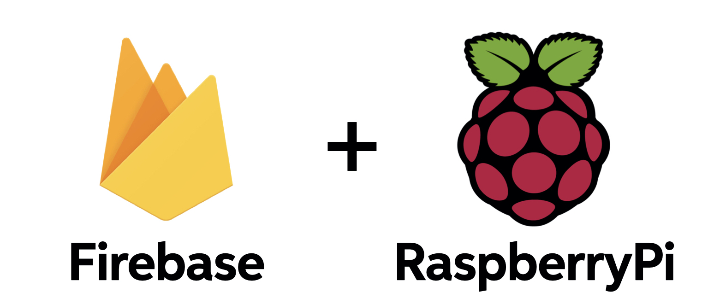

# Backend

The application uses two different backends:

* **Firebase:** this service host the database and the storage of the application. More info [here](https://sergiopicca.github.io/smartPi-app/pages/backend-firebase.html)

* **REST server on Raspberry Pi:**  the device that is installed in your house that controls the camera and the servo motor. More info [here](https://sergiopicca.github.io/smartPi-app/pages/backend-raspberry.html)
