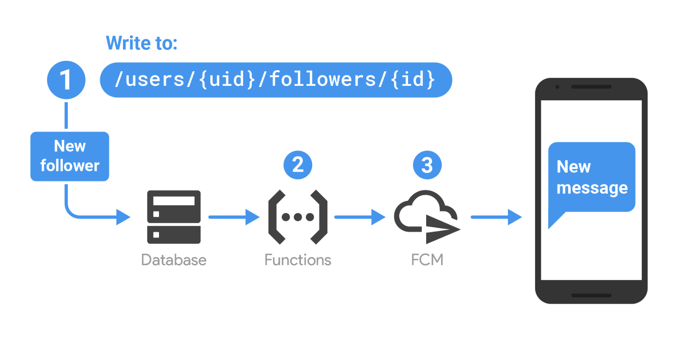

# Notifications

We decided to give a separate section to notifications, since they are an important part of our application and they are used not only to tell the user that a new message from the family chat has arrived, but most important to **inform the user that some stranger is breaking inside the house**. Since this last functionality is very important, we though that was important for a user to receive notifications either when the application is visible and also when it is closed or is running in background. Therefore, we decided to implement a service and use **Firebase Cloud Messaging (FCM)**.


FCM topic messaging is based on the publish/subscribe model. If we ask for messages to the server after a determined amount of time in a periodic way, we waste our resources, starting from the phone battery, instead a publish/subscribe model is more useful allowing a client device to subscribe to one particular topic, in this case the house of which the user is owner or guest, and be notified when there are new messages delivered through the app. Topics are also important because allow you to send a message to multiple devices that have opted in to that particular topic, in this case suppose that the owner of the house is working and put his phone in "Do not disturb" mode, then **another member of the family**, guest of that house, **can be notified because he or she is subscribed to the same topic** (house). For clients, topics are specific data sources which the client is interested in. For the server, topics are groups of devices which have opted in to receive updates on a specific data source. Topics can be used to present categories of notifications, such as news, weather forecasts, and sports results. More information in the official [documentation](https://firebase.google.com/docs/cloud-messaging/android/topic-messaging).


## Serverless architecture


As we argued before one the feature that we would like to ensure is be notified even if the app is running in the background or even if it is closed. In particular, to achieve this last functionality we decided to move to a serverless architecture using the **Firebase cloud functions**, that are an example of **FaaS (Function-as-a-service)**, exploiting the fact that we used the Realtime database for handling data to implement a **trigger**. When we work to Realtime database we have four type of triggers to work with, that responds to change in the database:

- ```onWrite()```, which triggers when data is created, updated, or deleted in Realtime Database.
- ```onCreate()```, which triggers when new data is created in Realtime Database.
- ```onUpdate()```, which triggers when data is updated in Realtime Database.
- ```onDelete()```, which triggers when data is deleted from Realtime Database.

Each of those triggers can be run on the backend managed by cloud functions and in each of this cases we have to specify a location in the database that can be affected by one of the components. Then you can notify the clients of your application to tell them that something has changed. The following figure shows a simple example.



This is a beta functionality and we use it to tell to the user that a new message has arrived so there was a change in the ```house-messages``` branch of the database.  

## Something is breaking in!

This type of notification, that is very important, is send to users by the RaspberryPi when the camera detects a movement and it is in "Motion detection" mode. Again, thanks to FCM with a little piece of code we are able to inform the users even if their application is closed, furthermore the camera automatically take a snapshot that the user can download.

```python
class FirebaseUtils:

def __init__(self, bucket, conf):
  self.bucket = bucket
  self.conf = conf
  self.push_service = FCMNotification(api_key=conf["api_key"])

```
