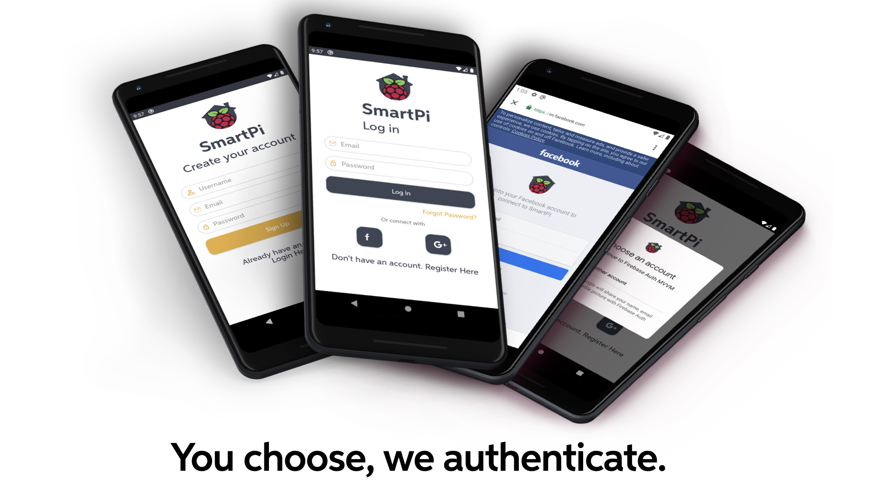

#  Login and registration

## Login
The Login gives you three different mode to access in our app.

### Email and password
It is the classic method: once you are registered, you put in the fields your email and password inserted during the registration step. The reference to the doc can be found [here](https://firebase.google.com/docs/auth/android/password-auth)

### Google
If you have a Google account and you do not want to have some troubles with remembering your password, it will be the authentication that you need: pressing the Google button you automatically are signed up and then logged in our app. The reference to the Google authentication documentation can be found [here](https://firebase.google.com/docs/auth/android/google-signin)

### Facebook
In the same way of Google authentication, the Facebook button does the same operation but it uses your Facebook account. The reference to the Facebook authentication documentation can be found [here](https://firebase.google.com/docs/auth/android/facebook-login)

## Registration
More in depth, let us see the phase of registration.
First of all, the user has to fill the form with his email, username and password and once he has completed it, the next step is to create an house or join an existing house.

### New house

This option is suggested when you are new to this system and you are the owner of you house and you want to set up your video surveillance system. The form to complete provides information about your house (address, geolocalization and eventually the telephone number) in order to recognize it. At the end, you are redirected to the Home Activity in your house.

The geolocalization is managed by [Google Maps](https://developers.google.com/maps/documentation), where using the search bar on the top, you are able to place the marker on the map according to the address inserted but at the beginning, it uses your currently location if you allow the access to the GPS.

### Existing house

If you are new and someone has suggested to use this app, probably he will provide also a code of his house: the only thing that you need is to insert it in the field and then you will be redirected to the Home Activity.

## What if I lose my password?
If you are registered with your email and you forget your password, you can reset it in order to log in again without any problems.
