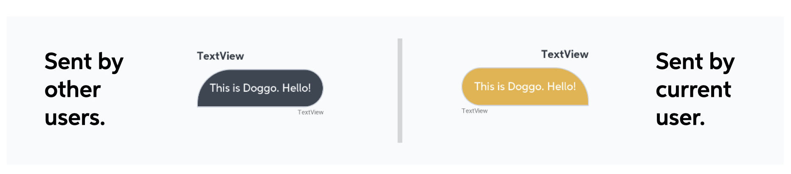

#  Yoshi, you have a new message!

One the features of our application was to integrate a little chat allowing the owner of the house and his guests, let's say his **family**, to communicate in order to leave some simple message, maybe also regarding the house, such as "Hi guys, remember that the video surveillance system is active!".


The chat is a simple recycler view displaying the messages, but we had to define two different kinds of layout for each item, because of the different senders, basically the user should be able to distinguish his own messages, that in this case are the one in orange. We decided also to add the profile picture of each user near the message box, by using **Picasso** library, in order to recognize in a strait forward way the sender.

## Two different layouts for the items
Let's have a look to the ```MessageAdapter``` holding the messages of the recycler view, in particular to two important variables:
```java
  class MessageAdapter: RecyclerView.Adapter<MessageAdapter.ViewHolder>() {
     private val VIEW_TYPE_MY_MESSAGE = 1
     private val VIEW_TYPE_OTHER_MESSAGE = 2
```

This two variables are used to distinguish the two different types of messages that the adapter should display, according to the sender value, then two different kind of layouts will be inflated.

```java
override fun getItemViewType(position: Int): Int {
    val msg = data.get(position)
    val isMine = msg.sendByMe
    if(isMine){
        return VIEW_TYPE_MY_MESSAGE
    }
    else{
        return VIEW_TYPE_OTHER_MESSAGE
    }
}

override fun onCreateViewHolder(parent: ViewGroup, viewType: Int): ViewHolder {
    if(viewType == VIEW_TYPE_MY_MESSAGE) {
        val layoutInflater = LayoutInflater.from(parent.context)
        val view = layoutInflater
            .inflate(R.layout.chat_to_row, parent, false)
        return ViewHolder(view)
    } else {
        val layoutInflater = LayoutInflater.from(parent.context)
        val view = layoutInflater
            .inflate(R.layout.chat_from_row, parent, false)
        return ViewHolder(view)
    }
}
```

The ```Message``` class as we will describe in the model section has a field that tells if the current logged user is the sender of the message or not, assuming value **true** or **false** respectively. The two items view are specular, the one is just the reflection of the other, with a different color for the chat bubble.



## Read and send messages

The messages are stored in the ```house-messages``` node of the json file on Firebase Realtime database, under the house id of which the user is owner or guest and they are retrieved by using the ```ChildEventListener``` . Everything happens inside the following function.
```java
private fun getMsgFromFirebase(f:FirebaseCallbackMsg){
        // Id of the first house
        val mHouse = _house.value
        val mPath = "house-messages"

        val refMsg = FirebaseDatabase.getInstance().getReference("/${mPath}/${mHouse}/")
```
The method takes a callback function that will be the one that will add the messages to the list associated to the recycler view. The two variables ```mPath``` and ```mHouse``` are used to define the correct reference path to access inside the storage, in particular the latter contains the id of the house that is required to get the correct messages. The ```ChildEventListener``` listener is slightly different from the ```EventValueListener``` and the ```SingleEventValueListner``` since we listen for a particular item of the list of the json file, then we needed to override four methods

```java
refMsg.addChildEventListener(object : ChildEventListener {
  override fun onChildAdded(p0: DataSnapshot, p1: String?) {
      // Get the messages from the realtime db
      val newMsg = p0.getValue(ChatMessage::class.java)
      if(newMsg != null){
          f.onCallbackMsg(newMsg)
      }
  }

  override fun onChildMoved(p0: DataSnapshot, p1: String?) {
      // ...
  }

  override fun onChildChanged(p0: DataSnapshot, p1: String?) {
      // ...
  }

  override fun onChildRemoved(p0: DataSnapshot) {
      // ...
  }

  override fun onCancelled(p0: DatabaseError) {
      // ...
  }
  })
```

When a new message is retrieved we invoke a callback method that basically just add the message the the ```MutableLiveData<MutableList<Message>>```. The ```ChatMessage``` class is a support class to hold just the significant information of the message, then the additional field like the ```sendByMe``` will be added in the ```onCallbackMsg```.

```java
private fun readMsg(){
  val supportList = mutableListOf<Message>()
  getMsgFromFirebase(object : FirebaseCallbackMsg{
      override fun onCallbackMsg(m:ChatMessage) {
          val usr = _users.value?.get(m.fromId)!!
          if(usr.uid == currentUserId){
              supportList.add(Message(m.id,m.text,usr.username,usr.profileImageUrl,true, m.timestamp))
              _completeMessages.value = supportList

          }else{
              supportList.add(Message(m.id,m.text,usr.username,usr.profileImageUrl,false, m.timestamp))
              _completeMessages.value = supportList
          }
      }
  })
}
```

We need a support list because we cannot directly add elements to the mutable live data ```_completeMessages``` list, so every time we should reassign its value. All these functions **are performed insider the view model** of the chat fragment.
