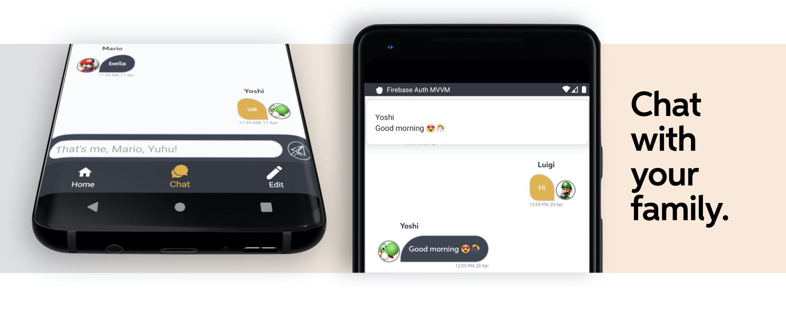

#  Yoshi, you have a new message!

One the features of our application was to integrate a little chat allowing the owner of the house and his guests, let's say his **family**, to communicate in order to leave some simple message, maybe also regarding the house, such as "Hi guys, remember that the video surveillance system is active!".

The chat is a simple recycler view displaying the messages, but we had to define two different kinds of layout for each item, because of the different senders, basically the user should be able to distinguish his own messages, that in this case are the one in orange. We decided also to add the profile picture of each user near the message box, by using **Picasso** library, in order to recognize in a strait forward way the sender.
