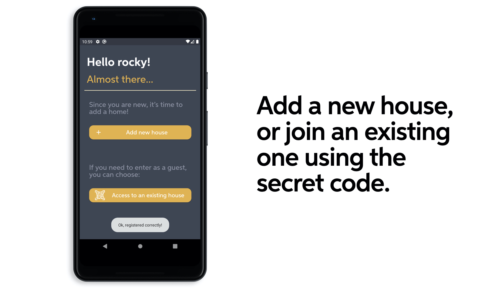
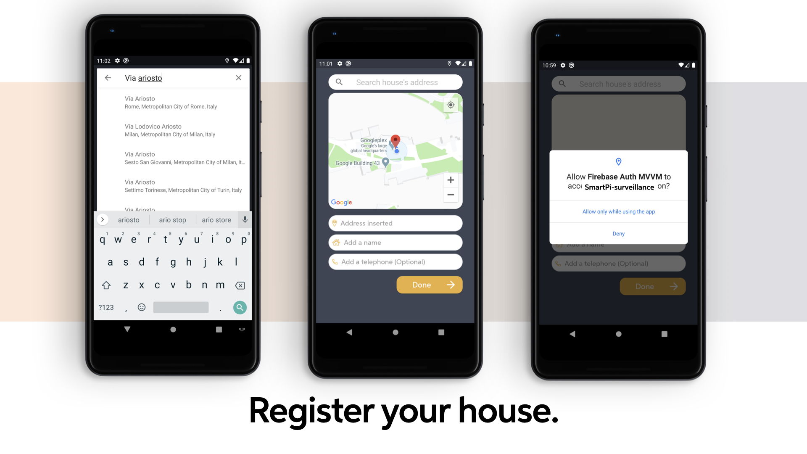

#  First usage
In the [Login and Registration](https://sergiopicca.github.io/smartPi-app/pages/ui-auth.html) page we give an introduction about all the possible choices to authenticate a user.
In this section we are going to explain more in detail what happens when a new user is authenticated for the first time and he would like to join or create a house where he lives.



So as we can see we have two buttons where the user can tap according to his necessity: the first one is "Add new house", where he is going to create a new house and the second one is "Add an existing house". If we choose the first option, we will see the following activity

## New House


First of all, we have to clarify that all these functionality are offered by Google through [Google Maps API](https://developers.google.com/maps/documentation) and we used a little tutorial as a "guide-line" from [here](https://www.raywenderlich.com/230-introduction-to-google-maps-api-for-android-with-kotlin).



In detail, the search bar on the top is an ```AutocompleteFragment``` which is provided by Google. This widget gives the opportunity to search each address on the world (or if you want a specific country, you can set it easily) and once the user has chosen one of them, a ```Place``` is obtained by the callback and a ```Marker``` is pointed out on the map, which is a ```SupportMapFragment```.

The ```Place``` has some features and in our case, we decided to use these one: ```name```, ```latLng``` and ```address```. The feature captured are used in two functions:

```java
private fun placeMarkerOnMap(location: LatLng) {
        val markerOptions = MarkerOptions().position(location)

        lastMarker = map.addMarker(markerOptions)
        map.animateCamera(CameraUpdateFactory.newLatLngZoom(location, 18f))
    }
```
In this little snippet, we take in input the ```latLng``` of the ```Place``` and we place the ```Marker``` on the map and we zoom the area interested.

The result ```p0``` is the callback obtained by the searched address and it is fixed in the ```EditText``` of the ```FirstUsageActivity```

```java
text_address_map.setText(p0.address)
```
The most of the work is done: now the user has to add a name of this house and optionally the telephone.
When all the information are inserted in the form, the user can send them to the database in order to store the new house.

## Existing house
(IMAGE ABOUT EXISTING HOUSE)
The user has the possibility to join an existing house by inserting the code obtained when the house is successfully created. There is no trick there is no deception.
