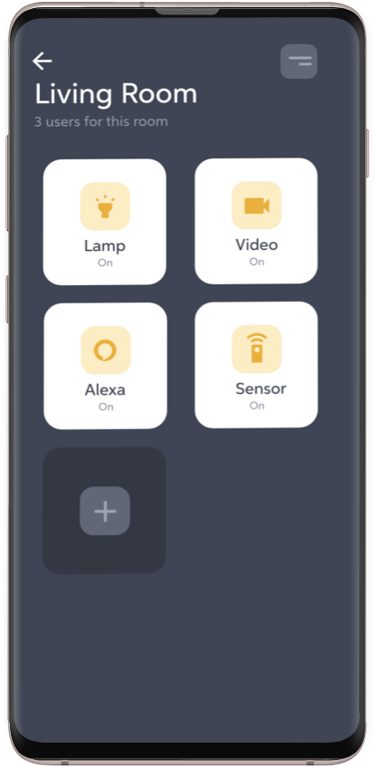

#  Room details


Once the user click on a particular room, this is the view presenting the devices of the room. Here the user can select one device, depending what he or she would like to do. For our application we actually implemented only the camera, so the other device are simply *unavailable**; however the application can be extended for instance to control some lights in the room, actually this functionality will be probably included in one next version.

##  Room detail fragment

In our code the fragment holding the room is called RoomDetailFragment, that hosts a recycler view with a **grid layout** to display the devices:
```java
// Set the GridLayout
val manager = GridLayoutManager(activity, 2)
binding.deviceList.layoutManager = manager

// Change the view
// Add the room name
binding.name.text = roomName
binding.labelDevices.text = deviceLabel

// Get the devices of the room
roomDetailViewModel.getDevices(homeId,roomId)

// Pass the devices to the adapter
roomDetailViewModel._devices.observe(viewLifecycleOwner, Observer {
    it?.let {
        adapter.submitList(it)
    }
})
```
In the above code we set the grid layout, we assign the room name, the subtitle (the label), and we call the function from the view model in order to get the devices from the real-time database, so we observe the variable **_devices** that is a Mutable LiveData, holding all the devices of the room and once the data is ready we assign the list to the adapter.
